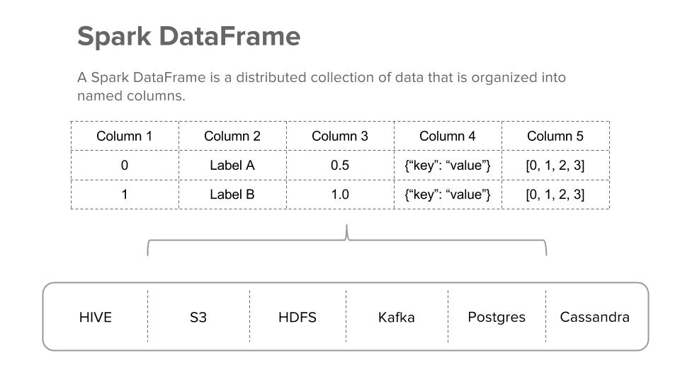
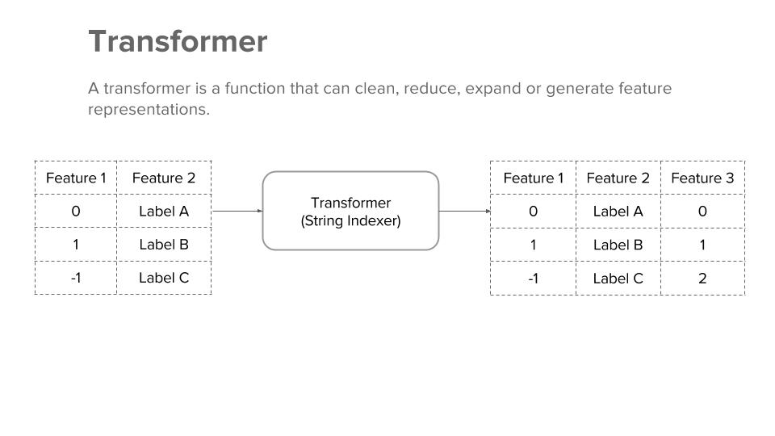
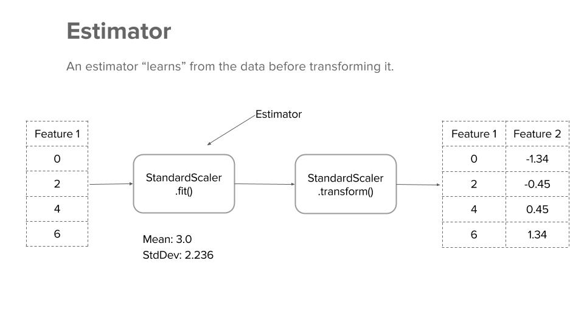

# Model Deployment With Spark and MLeap

## Writing Spark ML Pipelines to Train Models

The Spark ML Pipelines API leverages the now standard scikit-learn components to create model uniformity and comparability. In this section, we cover the basics of DataFrame, Transformer, Estimator, Pipeline and Parameter and frame our price prediction challenge.

### DataFrame

A Spark DataFrame is a distributed collection of data that is organized into named columns. You can think of it as table in a relational database or a DataFrame in python pandas. In Spark, the DataFrame API allows you to access distributed data from Hive, HDFS, external tables, streams, as well as many other sources of data. When working with data in Spark, you will most often be working with a DataFrame.

### Transformer

A transformer is a function that can clean, reduce, expand or generate feature representations. In Spark, a transformer converts a DataFrame into another by appending one or more computed columns.

The four most common transformer types are:
* Classification: Binary/Multi-label classification models
* Clustering: Non-parametric classification models
* Feature: Compute/Transform dependent variables
* Regression: Linear and Tree-based regression models

### Estimator

An Estimator is a concept of learning from the data before transforming it. For example, to perform a Standard Scaler transformation, we first must learn from the data what the mean and standard deviation values are. Spark Estimators are implemented within the `.fit()` method. 

